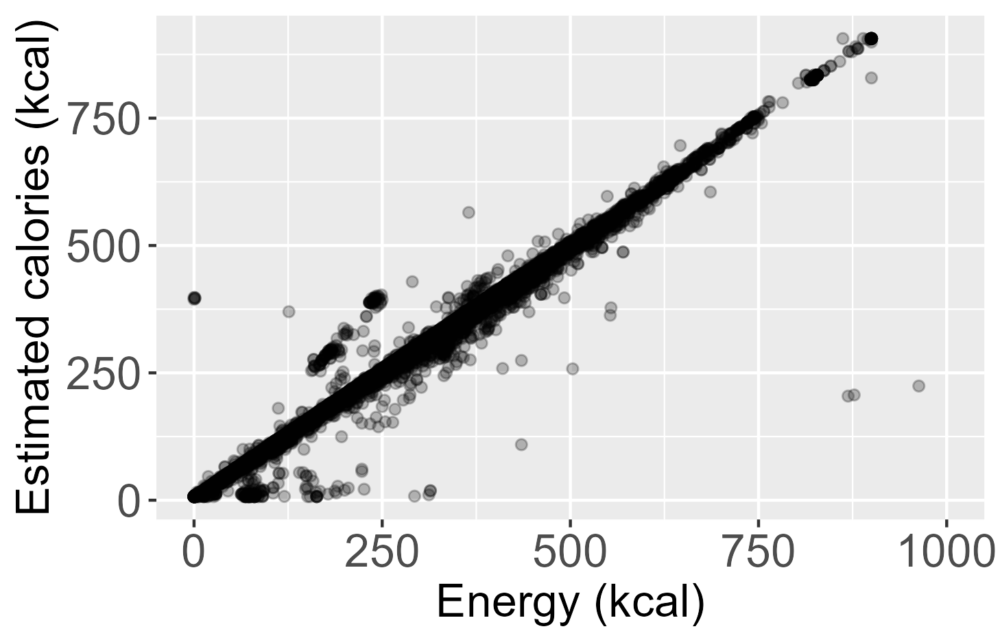

`code/main.py` iterates over product urls in `data/product_URLs.xml` and retrieves price information from [Albert Heijn](https://www.ah.nl). Product information is stored as a csv. Due to rate-limiting protocols, asynchronous scraping is not possible, retrieving all data should take 5-6 hours.

Interesting findings are presented below

## Estimation of energy (kcal) from nutrition data

The caloric energy in a food product can be estimated through a linear function with $R^{2} = 0.975$ through the following linear function:

$$ \text{Energy (kcal)} = 3.93 \times \text{carbohydrates} + 4.06 \times \text{protein} + 8.99 \times \text{fats} + 7.13 $$

  

Where the macronutrients are expressed in grams per 100 grams or 100 ml of product

### Outliers in the estimation consist of a few particular products:

1. Artifically sweetened products due to these sweeteners being included in the website's carbohydrate count
2. Alcoholic beverages due to alcohol content not being part of the equation but significantly contributing to calorie counts.
3. Gluten-free flours contain little carbohydrate and mostly dietary fiber, which we do not account for
4. Products consisting almost entirely of glucose syrup, though it is unclear why

Through this analysis, 5 products were found where the albert heijn website has accidentally switched kcal with kJ, leading to our wrong prediction:
- [Flower Farm Hazelnootpasta zonder palmolie](https://www.ah.nl/producten/product/wi532254/flower-farm-hazelnootpasta-zonder-palmolie)
- [Ghaia Surinaamse roti gele erwten](https://www.ah.nl/producten/product/wi558400/ghaia-surinaamse-roti-gele-erwten)
- [Garden Gourmet Sensational chipolata](https://www.ah.nl/producten/product/wi577209/garden-gourmet-sensational-chipolata)
- [Garden Gourmet Sensational merguez](https://www.ah.nl/producten/product/wi577210/garden-gourmet-sensational-merguez)
- [Knorr Spaghetteria formaggio](https://www.ah.nl/producten/product/wi574291/knorr-spaghetteria-formaggio)
