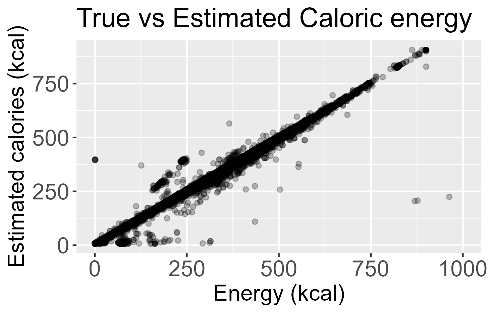
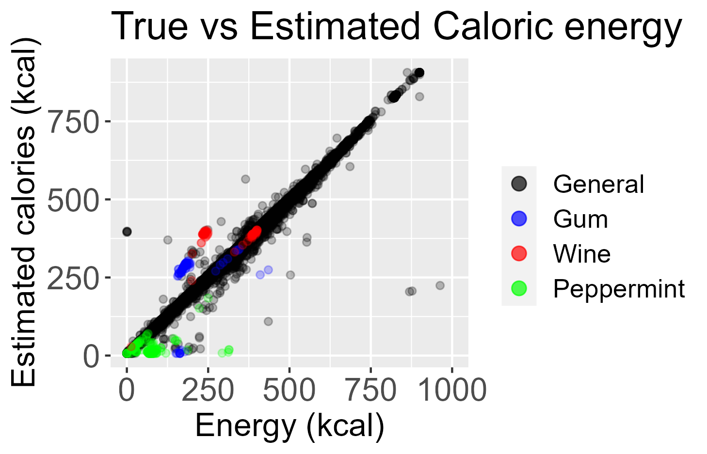

> [!NOTE]
> Web-scraping was performed respecting Albert Heijn's scraping policies as specified by https://www.ah.nl/robots.txt (July 8th, 2024)

`code/main.py` iterates over product urls in `data/product_URLs.xml` and retrieves product information from [Albert Heijn](https://www.ah.nl). Product information is stored as a csv. Due to rate-limiting protocols, asynchronous scraping is not possible, retrieving all data should take 5-6 hours.

Interesting findings are presented below

## Estimation of energy (kcal) from nutrition data
*(July 8th, 2024)*

The caloric energy in a food product can be estimated with $R^{2} = 0.975$ through the following linear function:

$$ \text{Energy (kcal)} = 3.93 \times \text{Carbohydrates (g)} + 4.06 \times \text{Protein (g)} + 8.99 \times \text{Fats (g)} + 7.13 $$

  

Where the macronutrients are expressed in grams per 100 grams or 100 ml of product

### Outliers in the estimation consist of a few particular products:

1. Artifically sweetened products due to these sweeteners being included in the website's carbohydrate count
2. Alcoholic beverages due to alcohol content not being part of the equation but significantly contributing to calorie counts.
3. Some gluten-free flours contain little carbohydrate and mostly dietary fiber, which we do not account for.
4. Products consisting almost entirely of glucose syrup, though it is unclear why.

Through this analysis, 5 products were found where the albert heijn website has accidentally switched kcal with kJ, leading to our "wrong" prediction:
- [Flower Farm Hazelnootpasta zonder palmolie](https://www.ah.nl/producten/product/wi532254/flower-farm-hazelnootpasta-zonder-palmolie) (2288 kcal, 547 kJ)
- [Ghaia Surinaamse roti gele erwten](https://www.ah.nl/producten/product/wi558400/ghaia-surinaamse-roti-gele-erwten) (963 kcal, 228 kJ)
- [Garden Gourmet Sensational chipolata](https://www.ah.nl/producten/product/wi577209/garden-gourmet-sensational-chipolata) (877 kcal, 212 kJ)
- [Garden Gourmet Sensational merguez](https://www.ah.nl/producten/product/wi577210/garden-gourmet-sensational-merguez) (869 kcal, 210 kJ)
- [Knorr Spaghetteria formaggio](https://www.ah.nl/producten/product/wi574291/knorr-spaghetteria-formaggio) (435 kcal, 104 kJ)

Because 1 kcal = 4.184 kJ, a product cannot contain more kcal than kJ (As of July 8th, 2024, I informed Albert Heijn about this through e-mail).

We can colour points in the previous plot according to some of our identified categories and find that many outliers do indeed correlate with sugar-free products and alcoholic beverages.

  

In all categories we see that their Non-sugar free and Non-alcoholic counterparts line up correctly with our prediction data. Most uncategorized outliers still consists of sugar-free products such as coffee sweeteners and sugar-free jams, but due to Albert Heijn not including separate categories for sugar-free products these are difficult to plot categorized.
